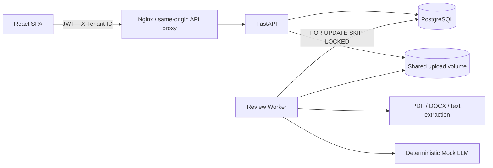

# AI Document Review SaaS

一个可本地运行的多租户 AI 文档审核产品级 MVP。固定演示用户通过真实的邮箱密码登录，API 使用 JWT 和数据库 membership 执行租户隔离；上传文档后，独立 Worker 异步生成可复现的结构化 Mock LLM 审核结果。

## 功能范围

- 真实登录、refresh session、退出登录及 `owner / admin / reviewer / viewer` RBAC
- 一个用户可加入多个租户；每次业务读写同时验证用户 membership 和资源 `tenant_id`
- 支持 `.pdf`（文本层）、`.docx`、`.txt`、`.md`，单文件最大 20 MB
- PostgreSQL 任务队列、Worker lease、指数退避自动重试与完整不可变历史
- 风险等级、风险分数、摘要、问题证据、定位、建议及建议改写
- 历史列表、租户切换、受保护的原文件下载；首版不做浏览器内预览
- 确定性 Mock LLM，不需要外部模型密钥

## Architecture



数据库 schema 由 Alembic 管理。Compose 中 API 等待 PostgreSQL 健康后执行 `alembic upgrade head`，然后在应用启动时幂等写入演示租户、用户和 membership；API 健康后 Worker 与前端才会启动。原文件由 API 与 Worker 通过 Docker volume 共享。

更详细的安全边界、领域模型和任务语义见 [docs/architecture.md](docs/architecture.md)。

## Quick start

需要 Docker Desktop 或 Docker Engine + Compose plugin。

```bash
cp .env.example .env
# 本地也建议替换 JWT_SECRET
docker compose up --build
```

打开 <http://localhost:5173>。API OpenAPI 页面位于 <http://localhost:8000/docs>。

演示账号使用同一个密码 `DemoPass123!`：

| 用户 | Membership | 用途 |
| --- | --- | --- |
| `owner@acme.local` | Acme `owner`；Northwind `viewer` | 验证租户切换和跨角色行为 |
| `reviewer@acme.local` | Acme `reviewer` | 上传、审核、失败重试 |
| `viewer@northwind.local` | Northwind `viewer` | 验证只读权限与跨租户拒绝 |

账号仅用于本地演示，不应部署到公网。停止服务使用 `docker compose down`；加 `-v` 会永久删除数据库和上传卷。

## Verify the complete flow

服务启动后，从 Nginx 的公开入口执行登录、上传、Worker 处理和结果查询：

```bash
python3 scripts/smoke_test.py
```

如使用其他地址：

```bash
SMOKE_BASE_URL=http://localhost:5173/api/v1 python3 scripts/smoke_test.py
```

## Local development

后端（本机运行 PostgreSQL 时相应修改根目录 `.env` 的 `DATABASE_URL`）：

```bash
cd backend
python -m venv .venv
source .venv/bin/activate
pip install -e '.[dev]'
alembic upgrade head
uvicorn app.main:app --reload
```

另一个终端启动 Worker：

```bash
cd backend
source .venv/bin/activate
python -m app.worker
```

前端：

```bash
cd frontend
npm install
npm run dev
```

测试：

```bash
cd backend && pytest
cd frontend && npm test -- --run
```

检查迁移是否与 SQLAlchemy metadata 一致：

```bash
cd backend
alembic check
```

## Configuration

`.env.example` 给出全部运行参数。至少在非本地环境中提供随机、不可提交的 `JWT_SECRET`，启用 HTTPS 后设置 `REFRESH_COOKIE_SECURE=true`。生产部署还应将 PostgreSQL 密码移出 Compose、限制 CORS、使用对象存储/恶意文件扫描，并由一个受控 release job 执行迁移。

## API flow

1. `POST /api/v1/auth/login` 登录并取得 access token；refresh token 仅保存于 HttpOnly cookie。
2. `GET /api/v1/tenants` 取得当前用户可访问的 tenant memberships。
3. 业务请求发送 `Authorization: Bearer …` 和当前 membership 的 `X-Tenant-ID`。
4. `POST /api/v1/documents` 上传文件并原子创建初始 Review Job；客户端可发送 `Idempotency-Key`，同一租户内相同 key 与相同内容会返回原结果，不会重复创建任务。
5. `GET /api/v1/review-jobs` 查看分页历史，`GET /api/v1/review-jobs/{id}` 查看结果。
6. 临时错误会根据 `JOB_RETRY_BASE_SECONDS * 2^(attempt-1)` 延迟创建自动 retry 子任务；`POST /api/v1/review-jobs/{id}/retry` 也会为失败任务创建新的 Review Job。任何重试都不会覆盖原任务。
