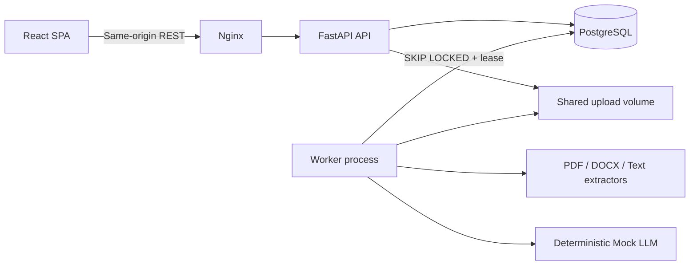

# Build multi-tenant document review

> Build a multi-tenant document review SaaS.
> 多租户 AI 文档审核系统
>
> 用户上传合同、政策文档或业务材料，系统创建 Review Job，LLM 做结构化审核，例如风险等级、问题列表、建议修改，用户可以查看历史结果、重试失败任务。
>
> 技术栈偏向于：
> React + FastAPI + PostgreSQL + Worker + LLM/mock LLM + Docker
> 允许通过AI mocking数据，不接真实llm，简化实现
>
> First analyze the requirements and propose the architecture.
> Then implement the system incrementally.
> [$grill-me](~/.codex/skills/grill-me/SKILL.md)

<details><summary>4 previous messages</summary>

> 我会先使用你指定的 `grill-me` 技能，对需求里的关键假设、租户隔离、安全边界和 MVP 范围做一轮严格访谈；确认到足以落地后，再给出架构并开始增量实现。当前没有名为 “Skill” 的可调用工具，所以我会直接读取并遵循你提供的技能文件。
>
> <details><summary>Explored a file</summary>
>
> - Read `~/.codex/skills/grill-me/SKILL.md`
>
> </details>
>
> 技能文件本身只要求调用 `Skill("grilling")`，但本会话没有暴露该工具。我会按它的意图执行同等的严格需求访谈，并先快速检查当前仓库，避免询问能从代码中直接确认的问题。
>
> <details><summary>Ran 2 commands</summary>
>
> - Ran `pwd && rg --files -g 'AGENTS.md' -g '!node_modules' -g '!dist' | head -20 && rg --files -g '!node_modules' -g '!dist' | head -80`
> - Ran `git status --short && sed -n '1,260p' README.md && sed -n '1,300p' docs/architecture.md && find . -name AGENTS.md -print`
>
> </details>
</details>

我发现仓库里已经有一套未提交的 MVP 草稿，当前假设是：无登录，通过 `X-Tenant-ID` 切换租户。这个决定直接影响数据库模型、API 和前端。

第一问：你要的是可演示原型，还是具备真实登录与租户成员隔离的产品级 MVP？

我的建议是先做可演示原型，但把认证边界设计成可替换接口；否则首个增量会明显扩大到用户、成员关系、JWT/OIDC 和 RBAC。

> 具备真实登录与租户成员隔离的产品级 MVP

第二问：身份认证采用哪种方式？

我建议 MVP 使用“邮箱 + 密码 + 邀请制加入租户”：

- 首位注册用户创建租户并成为 `owner`
- 其他用户只能通过邀请加入
- 一个用户可以属于多个租户
- 角色先设 `owner / admin / reviewer / viewer`
- API 使用短期 access token，refresh token 放在 `HttpOnly + Secure + SameSite` Cookie
- 禁止用户通过前端传入任意 `tenant_id` 越权；当前租户必须来自已验证的 membership

你是否接受这个身份与成员模型？如果不接受，请说明希望使用企业 SSO/OIDC，还是其他登录方式。

> 先用hardcode的方式，固定若干个租户和用户，以便本地运行

可以，但“hardcode”只用于初始化数据，不能绕过鉴权，否则无法验证真实的租户隔离。

我建议：

- PostgreSQL 启动时 seed 3 个固定用户、2 个租户及 membership
- 用户仍通过邮箱和密码登录
- 密码以 hash 存储，不在 API 响应或前端代码中暴露
- 登录后签发 JWT
- 切换租户时，后端验证该用户确实属于目标租户
- 至少设置一个跨租户用户，用于验证多租户切换
- 至少设置一个单租户用户，用于验证越权访问被拒绝
- 本地演示账号写入 README

第三问：是否接受这套“固定种子数据 + 真实登录/JWT + 真实 membership 校验”的方式？

> 接受

第四问：同一租户内的文档与审核结果，是团队共享还是仅上传者可见？

我建议采用租户共享工作区，并实现最小 RBAC：

- `owner/admin`：查看全部内容、上传、创建审核、重试失败任务
- `reviewer`：查看全部内容、上传、创建审核、重试失败任务
- `viewer`：只能查看文档与审核结果
- 所有业务查询必须同时校验 `tenant_id + membership`
- 记录 `created_by_user_id`，为后续审计和个人视图保留能力

是否接受？

> 接受

第五问：首版支持哪些文件格式？

我的建议是支持：

- `.pdf`：仅提取文本层，不做扫描件 OCR
- `.docx`
- `.txt`
- `.md`
- 单文件上限 20 MB
- 空文本、加密 PDF、损坏文件直接创建失败任务，并展示可重试/不可重试的明确原因
- 原始文件保存在 Docker volume；数据库只保存元数据、存储 key 和提取后的文本
- 暂不支持旧版 `.doc`、图片、批量上传和压缩包

是否接受？

> 接受

第六问：审核结果采用什么结构，是否需要定位原文？

我建议 Mock LLM 返回稳定、可替换为真实 LLM 的结构：

- `overall_risk_level`: `low | medium | high | critical`
- `risk_score`: `0–100`
- `summary`
- `issues[]`
  - `category`
  - `severity`
  - `title`
  - `description`
  - `evidence`：原文摘录
  - `location`：页码或段落编号（可为空）
  - `recommendation`
  - `suggested_revision`
- `review_scope`：合同、政策或通用材料
- `model_name`、`prompt_version`、`reviewed_at`

Mock 结果应由文档内容确定性生成，测试可复现；包含特殊标记的测试文档可触发临时失败，以验证重试流程。

是否接受？是否还需要“审核规则/模板”选择，例如合同审核、隐私政策审核、合规审核？

> 1 接受 2不需要

第七问：任务队列和重试语义。

我建议产品级 MVP 不额外引入 Redis/Celery，直接使用 PostgreSQL 队列：

- API 在同一事务中创建 `Document + ReviewJob`
- Worker 使用 `FOR UPDATE SKIP LOCKED` 抢占任务，支持多个 Worker
- 状态：`queued → processing → completed | failed`
- `locked_at` + lease timeout，用于回收 Worker 崩溃后卡住的任务
- 自动重试临时错误，指数退避，最多 3 次
- 文件损坏、无可提取文本等永久错误不自动重试
- 用户可手动重试失败任务；每次重试保留原 job 记录并创建新的 attempt/job，形成可审计历史
- 同一文档允许主动发起新的审核，不覆盖旧结果
- 使用幂等键避免上传请求重复创建任务

是否接受这套队列与重试语义？特别是“重试创建新记录，而不是重置原任务”。

> 接受

第八问：前端 MVP 的页面范围。

我建议实现以下完整闭环：

- 登录页：演示账号快捷填充，但仍走真实登录接口
- 应用壳：当前用户、角色、租户切换、退出登录
- Dashboard：任务总数、处理中、失败、高风险统计
- 文档上传页：拖拽上传、文件校验、上传进度
- 审核历史：分页、状态/风险等级筛选
- 审核详情：文档信息、执行 attempt 时间线、风险摘要、问题列表、建议修改
- 失败任务重试
- 403、404、任务失败及网络异常的明确状态
- 暂不实现用户/成员管理界面，因为成员由 seed 固定

是否接受这个前端范围？是否需要在浏览器内预览或下载原始文档？我的建议是首版只提供受鉴权保护的下载，不做复杂预览。

> 1 接受 2不做预览

第九问：交付与验收边界。

我建议本次交付以本地 Docker Compose 可完整运行作为验收标准：

- `frontend`：React + TypeScript + Vite，由 Nginx 提供并反向代理 `/api`
- `api`：FastAPI
- `worker`：与 API 共享 Python 代码，但独立进程
- `db`：PostgreSQL
- 数据库使用 Alembic migration；seed 命令幂等执行
- 上传文件放在共享 Docker volume
- 提供 `.env.example`、健康检查和一条启动命令
- 后端测试覆盖登录、membership/RBAC、跨租户越权、上传、Worker、失败重试
- 前端测试覆盖登录、租户切换、上传和任务详情关键交互
- 提供一条端到端 smoke test
- CI、云部署、邮件邀请、计费和真实 LLM 暂不纳入本次范围

是否接受？如果接受，我下一步会结束 grilling，先输出确定版需求分析与架构，然后基于仓库现有草稿分增量改造和验证。

> 接受。 [$tdd](~/.codex/skills/tdd/SKILL.md)

<details><summary>3 previous messages</summary>

> Grilling 已完成，关键产品决策已经收敛。我现在开始使用你指定的 `tdd` 技能；它要求在写任何测试前先明确并由你确认测试 seam，因此本轮我会先给出确定版架构与建议测试边界，暂停在确认点，不会提前写测试或实现。
>
> <details><summary>Explored 7 files, ran a command</summary>
>
> - Ran `sed -n '1,260p' /Users/tonyyan/.codex/skills/tdd/tests.md && sed -n '1,300p' /Users/tonyyan/.codex/skills/tdd/mocking.md && if test -f CONTEXT.md; then sed -n '1,260p' CONTEXT.md; fi && find . -maxdepth 3 \( -iname '*adr*' -o -path '*/decisions/*' \) -print`
>
> <details><summary>Explored 7 files</summary>
>
> - Read `./backend/app/api.py`
> - Read `./backend/app/models.py`
> - Read `./backend/app/schemas.py`
> - Read `./backend/tests/test_review_flow.py`
> - Read `./frontend/src/App.test.tsx`
> - Read `./backend/pyproject.toml`
> - Read `./frontend/package.json`
>
> </details>
>
> </details>
>
> <details><summary>Plan</summary>
>
> 需求访谈已完成。按 TDD 技能要求，先确认公共测试边界，再按垂直切片执行 red → green。
>
> - [ ] 整理确定版需求、架构与测试 seams，等待确认
> - [ ] Increment 1：认证、seed 用户与 JWT 会话
> - [ ] Increment 2：租户 membership、切换与 RBAC
> - [ ] Increment 3：文档上传、提取与安全下载
> - [ ] Increment 4：Review Job、Worker、Mock LLM 与重试历史
> - [ ] Increment 5：React 完整闭环与关键交互
> - [ ] Increment 6：Docker、迁移、smoke test 与最终验证
>
> </details>
</details>

需求已收敛，现有仓库草稿会作为参考，但需要从目前的 `X-Tenant-ID` 演示模型升级为真实认证和 membership 隔离。

## 确定版架构



核心设计：

- 认证：固定 seed 用户，但走真实邮箱密码登录、密码 hash、短期 JWT access token、可撤销 refresh session。
- 租户隔离：`User ↔ Membership ↔ Tenant`；每个租户请求都验证当前用户的 membership。
- RBAC：`owner/admin/reviewer` 可上传和重试，`viewer` 只读。
- 文档：支持 PDF、DOCX、TXT、MD，最大 20 MB；原文件进入共享 volume。
- 异步处理：API 只保存文件并创建任务；Worker 负责提取文本、Mock 审核及结果落库。
- 队列：PostgreSQL `FOR UPDATE SKIP LOCKED`，带 lease、超时回收和指数退避。
- 重试：原任务不可变；手动或自动重试创建新 `ReviewJob`，通过 `retry_of_job_id/root_job_id` 形成执行链。
- Mock LLM：由文档内容确定性生成风险等级、0–100 分数、摘要、问题、证据、位置及修改建议。
- 部署：React/Nginx、FastAPI、Worker、PostgreSQL 四类容器；Alembic 管理 schema，seed 命令幂等。
- 安全下载：不做浏览器预览；下载接口同时执行认证、membership 和资源租户校验。

主要数据表：

- `users`
- `tenants`
- `memberships`
- `refresh_sessions`
- `documents`
- `review_jobs`
- `idempotency_keys`

## TDD 测试 seams

按你指定的 TDD 技能，测试只通过以下已约定的公共边界观察行为：

1. **HTTP API seam**
   使用 FastAPI TestClient，通过登录、租户、文档及审核 API 验证行为；不直接查询数据库断言。

2. **Worker seam**
   通过 API 创建任务，运行公开的 Worker 单步入口，再通过 API 查询最终状态；不测试私有 claim/helper。

3. **React UI seam**
   通过用户可见 DOM 操作验证登录、租户切换、上传、历史和重试；仅在 HTTP 系统边界 mock API。

4. **Docker smoke seam**
   从已启动服务的公开 HTTP 地址完成登录、上传、Worker 处理、结果查询闭环。

实施会按垂直切片逐个执行 `red → green`，不会先批量写完所有测试。

请确认以上四个测试 seams。确认后我将从 Increment 1“固定用户真实登录”开始，第一个动作会是写一个失败的登录行为测试。

> spawn sub agent to do test and development in parallel, then in parent agent verify their work

<details><summary>22 previous messages</summary>

> 可以。我会按你的要求启用并行子代理，但会保留 TDD 的关键约束：测试代理只负责公共 API 行为测试，开发代理只负责实现；父代理最后会检查测试是否真正约束行为、审查 diff，并独立运行完整验证。由于共享工作区可能产生竞态，我会让两边修改互不重叠的文件，并在父代理中补做一次“测试敏感性”验证。
>
> <details><summary>Explored 7 files</summary>
>
> - Read `./backend/tests/conftest.py`
> - Read `./backend/app/main.py`
> - Read `./backend/app/dependencies.py`
> - Read `./backend/app/database.py`
> - Read `./backend/app/config.py`
> - Read `./backend/app/services.py`
> - Read `./backend/app/worker.py`
>
> </details>
>
> <details><summary>Explored 8 files</summary>
>
> - Read `./frontend/src/App.tsx`
> - Read `./frontend/src/api.ts`
> - Read `./frontend/src/types.ts`
> - Read `./frontend/src/styles.css`
> - Read `./compose.yaml`
> - Read `./backend/Dockerfile`
> - Read `./frontend/nginx.conf`
> - Read `./.env.example`
>
> </details>
>
> 并行工作已启动：测试侧正在定义登录与 membership 的外部行为，开发侧正在实现 seed 用户、密码 hash、JWT 和受保护的租户列表。我在父任务中已审阅现有前后端基线；下一步会先处理两边集成冲突，再独立验证越权与测试敏感性。
>
> 测试代理已经获得预期的 Red：当前 `POST /api/v1/auth/login` 返回 404，说明新测试确实在约束尚不存在的行为。它正在补齐剩余鉴权场景；开发代理仍在实现 Green。
>
> 第一轮并行结果已合并：新鉴权契约的 7 个测试由 Red 全部转为 Green。父任务现在开始独立审查实现；我会特别检查 JWT 校验、密码 hash、membership 查询是否可能越权，以及旧测试失败究竟是契约迁移还是回归。
>
> <details><summary>Explored 8 files, ran 2 commands</summary>
>
> <details><summary>Explored 8 files</summary>
>
> - Read `./backend/app/auth.py`
> - Read `./backend/app/models.py`
> - Read `./backend/app/dependencies.py`
> - Read `./backend/app/api.py`
> - Read `./backend/app/main.py`
> - Read `./backend/app/config.py`
> - Read `./backend/tests/test_auth_api.py`
> - Read `./backend/pyproject.toml`
>
> </details>
>
> - Ran `./.venv/bin/python -m pytest -q`
>
> - Ran `../.venv/bin/python -m pytest -q`
>
> </details>
>
> 父任务验证结果与代理报告一致：新鉴权测试 7/7 通过，旧审核测试的 4 个失败全部来自已移除的匿名租户头契约，并非随机回归。审查也发现下一增量必须补齐两点：refresh session 尚未接入，旧重试仍会原地重置任务，违反已确认的审计历史语义。现在进入第二轮并行切片，升级文档/Worker/重试行为并迁移旧测试。
>
> 第二轮测试已经写入，但开发侧刚加入 DOCX 提取依赖，当前本地虚拟环境尚未安装 `python-docx`，导致测试在 collection 阶段停止。这是依赖环境问题，不是行为测试结果；我会在实现落定后统一安装并重跑，避免把导入失败误判为 Red。
>
> 第二轮已经 Green：后端公共行为测试 16/16。父任务现在会做独立安全审查和完整复跑，重点检查 refresh token 是否只存 hash、是否旋转/撤销、下载是否防 IDOR、重试是否确实保留原任务，以及 Worker 对永久错误的状态处理。
>
> <details><summary>Explored 8 files, ran a command</summary>
>
> <details><summary>Explored 8 files</summary>
>
> - Read `./backend/app/api.py`
> - Read `./backend/app/services.py`
> - Read `./backend/app/worker.py`
> - Read `./backend/app/reviewer.py`
> - Read `./backend/app/document_text.py`
> - Read `./backend/app/schemas.py`
> - Read `./backend/app/auth.py`
> - Read `./backend/tests/test_review_flow.py`
>
> </details>
>
> - Ran `../.venv/bin/python -m pytest -q && ../.venv/bin/python -m compileall -q app`
>
> </details>
>
> 父任务复跑后端为 16/16，通过编译检查。下载查询同时带资源 ID 与租户 ID，refresh token 仅存 SHA-256 hash，并在刷新时旋转撤销；重试也确实创建新记录。现在进入第三轮并行切片：测试代理从登录页和角色可见行为定义 UI 契约，开发代理将现有匿名工作台升级为真实登录、租户切换、只读角色和新版审核报告。
>
> <details><summary>Ran a command</summary>
>
> - Ran `sed -n '1,460p' backend/app/models.py && sed -n '1,260p' backend/app/config.py && git status --short`
>
> </details>
>
> 第三轮 UI 测试已完成契约编写，但开发代理正在原位重写 `App.tsx`，测试暂时因入口文件短暂缺失而无法 collection。这属于共享工作区的瞬时状态；我已确认两边文件范围没有重叠，等组件写回后再取得真实的 Red/Green 结果。基础设施代理同时在补 Alembic 与同源 Nginx 代理。
>
> 第三轮前端与基础设施均已完成：UI 测试 7/7，TypeScript/构建通过，Alembic fresh upgrade 与 metadata drift 检查通过。基础设施审查主动指出一个真实缺口：Worker 还没有实现已确认的“临时错误自动重试 + 退避”。父任务不会把它留作已知问题；完成本轮独立复验后，我会再开一轮小型并行 TDD，补自动重试、refresh 生命周期测试和上传幂等。
>
> <details><summary>Explored 9 files, ran a command</summary>
>
> - Ran `PATH=/Users/tonyyan/.cache/codex-runtimes/codex-primary-runtime/dependencies/node/bin:$PATH npm test -- --run && PATH=/Users/tonyyan/.cache/codex-runtimes/codex-primary-runtime/dependencies/node/bin:$PATH npm run build`
>
> <details><summary>Explored 9 files</summary>
>
> - Read `./compose.yaml`
> - Read `./backend/Dockerfile`
> - Read `./frontend/nginx.conf`
> - Read `./backend/alembic/versions/20260819_0001_initial_schema.py`
> - Read `./scripts/smoke_test.py`
> - Read `./README.md`
> - Read `./docs/architecture.md`
> - Read `./frontend/src/api.ts`
> - Read `./frontend/src/types.ts`
>
> </details>
>
> </details>
>
> 第四轮已取得可验证的 Red：refresh cookie 的既有实现测试直接通过；幂等与自动重试的 4 个新行为测试失败。失败点正位于开发代理正在修改的上传服务签名，说明测试确实命中了新增公共能力，而不是内部实现细节。
>
> 第四轮 Green：后端现为 22/22，通过 refresh 轮换、退出撤销、幂等冲突、三次自动重试上限和永久错误不重试。应用模型已经新增 `available_at` 与幂等记录，因此我现在让基础设施代理同步 Alembic 和文档；之后父任务会独立执行 migration drift、全套后端/前端测试及构建。
>
> <details><summary>Explored 11 files</summary>
>
> - Read `./backend/app/models.py`
> - Read `./backend/app/services.py`
> - Read `./backend/app/worker.py`
> - Read `./backend/app/reviewer.py`
> - Read `./backend/app/api.py`
> - Read `./backend/tests/test_idempotency_and_auto_retry.py`
> - Read `./backend/tests/conftest.py`
> - Read `./backend/app/main.py`
> - Read `./backend/app/config.py`
> - Read `./backend/app/auth.py`
> - Read `./frontend/src/App.tsx`
>
> </details>
>
> 所有子代理工作已经结束，进入父任务最终验证。我会使用独立命令重新执行：22 个后端行为测试、7 个前端 DOM 测试、TypeScript/Vite 构建、Alembic fresh upgrade + drift check + downgrade，并检查配置文件与仓库状态。Docker 引擎在当前环境不可用，因此容器级 smoke 会明确标记为“已提供脚本、未现场运行”。
>
> <details><summary>Ran 5 commands</summary>
>
> - Ran `../.venv/bin/python -m pytest -q && ../.venv/bin/python -m compileall -q app && DATABASE_URL=sqlite:////private/tmp/ai-doc-review-parent-20260819.sqlite ../.venv/bin/alembic upgrade head && DATABASE_URL=sqlite:////private/tmp/ai-doc-review-parent-20260819.sqlite ../.venv/bin/alembic check && DATABASE_URL=sqlite:////private/tmp/ai-doc-review-parent-20260819.sqlite ../.venv/bin/alembic downgrade base`
> - Ran `PATH=/Users/tonyyan/.cache/codex-runtimes/codex-primary-runtime/dependencies/node/bin:$PATH npm test -- --run && PATH=/Users/tonyyan/.cache/codex-runtimes/codex-primary-runtime/dependencies/node/bin:$PATH npm run build`
> - Ran `git status --short && sed -n '1,260p' .gitignore && sed -n '1,260p' .env.example && sed -n '1,260p' backend/pyproject.toml && command -v docker`
> - Ran `../.venv/bin/python -m py_compile ../scripts/smoke_test.py && ../.venv/bin/python -m pip check`
> - Ran `rg -n "TODO|FIXME|pass$|NotImplemented" . -g '!frontend/node_modules/**' -g '!frontend/dist/**' -g '!backend/ai_document_review_api.egg-info/**' -g '!backend/tests/.runtime/**' || true && find backend/alembic frontend/src backend/app backend/tests scripts docs -type f | sort`
>
> </details>
>
> <details><summary>Plan</summary>
>
> 全部增量已实现并由父任务独立复验；仅容器级 live smoke 因本机无 Docker 引擎未运行，但脚本与 Compose 已就绪。
>
> - [x] 整理确定版需求、架构与测试 seams，等待确认
> - [x] Increment 1：认证、seed 用户与 JWT 会话
> - [x] Increment 2：租户 membership、切换与 RBAC
> - [x] Increment 3：文档上传、提取与安全下载
> - [x] Increment 4：Review Job、Worker、Mock LLM 与重试历史
> - [x] Increment 5：React 完整闭环与关键交互
> - [x] Increment 6：Docker、迁移、smoke test 与最终验证
>
> </details>
</details>

已完成多租户 AI 文档审核产品级 MVP，并由父任务独立复验。

核心交付：

- 固定 seed 用户的真实邮箱密码登录
- Argon2 密码 hash、JWT、HttpOnly refresh token 轮换与撤销
- 多租户 membership 校验和 `owner/admin/reviewer/viewer` RBAC
- PDF、DOCX、TXT、MD 上传，最大 20 MB
- PostgreSQL Worker 队列、lease 恢复、自动重试和指数退避
- 确定性 Mock LLM 结构化审核结果
- 不可变 Review Job 重试历史
- 租户保护的原文件下载
- 上传 `Idempotency-Key`
- React 登录、租户切换、筛选、上传、报告、重试和只读模式
- Alembic、Docker Compose、Nginx 同源代理和 smoke test

主要入口：

- [README.md](./README.md)
- [架构文档](./docs/architecture.md)
- [Docker Compose](./compose.yaml)
- [FastAPI API](./backend/app/api.py)
- [React 应用](./frontend/src/App.tsx)
- [Smoke test](./scripts/smoke_test.py)

验证结果：

- 后端：22/22 passed
- 前端：7/7 passed
- TypeScript + Vite production build：通过
- Alembic fresh upgrade/check/downgrade：通过，无 metadata drift
- Python compile 与依赖检查：通过
- Docker live smoke：未运行，当前环境没有 Docker executable

本地启动：

```bash
cp .env.example .env
docker compose up --build
```

打开 `http://localhost:5173`，演示账号密码均为 `DemoPass123!`。当前文件尚未提交到 Git。

> git remote add origin git@github.com:Tony-Yan2018/ai-doc-review.git
> commit code in small granularity and open a PR

<details><summary>4 previous messages</summary>

> 我会使用 `github:yeet` 工作流发布这些改动：先确认仓库与分支状态，再按架构文档、后端、前端、基础设施/测试等小粒度分组提交，推送 `codex/` 分支并创建 Draft PR。该流程会实际写入 GitHub。
>
> <details><summary>Ran 4 commands</summary>
>
> <details><summary>Explored a file</summary>
>
> - Read `~/.codex/plugins/cache/openai-curated-remote/github/0.1.8-2841cf9749ae/skills/yeet/SKILL.md`
>
> </details>
>
> - Ran `git status -sb && git branch --show-current && git log --oneline --decorate -5 && git remote -v && gh --version && gh auth status`
>
> - Ran `git remote -v`
>
> - Ran `gh auth status`
>
> - Ran `gh --version`
>
> </details>
>
> 发布前置检查发现 `gh` 已安装，但当前 `Tony-Yan2018` 的 GitHub token 已失效。按发布工作流，我可以先添加你明确指定的 SSH remote；提交、推送和 Draft PR 需要你先重新完成 `gh` 登录。
>
> <details><summary>Ran a command</summary>
>
> - Ran `git remote add origin git@github.com:Tony-Yan2018/ai-doc-review.git`
>
> </details>
</details>

已添加 remote：

```text
origin  git@github.com:Tony-Yan2018/ai-doc-review.git
```

当前阻塞：`gh auth status` 显示 `Tony-Yan2018` 的 token 已失效。请在终端运行：

```bash
gh auth login -h github.com
gh auth status
```

完成后告诉我继续。我会再创建 `codex/` 分支、按小粒度提交、推送，并创建 Draft PR。

> gh auth status
> github.com
>   ✓ Logged in to github.com account Tony-Yan2018 (keyring)
> - Active account: true
> - Git operations protocol: ssh
> - Token: gho_************************************
> - Token scopes: 'admin:public_key', 'gist', 'read:org', 'repo'
>
> it is valid

<details><summary>14 previous messages</summary>

> 认证已恢复。我会继续发布：先创建 `codex/multi-tenant-document-review`，然后按“后端、后端测试、前端、前端测试、运行基础设施、文档”拆分提交；最后复跑检查、推送并创建 Draft PR。
>
> <details><summary>Ran 3 commands</summary>
>
> - Ran `gh auth status && git remote -v && git status -sb`
> - Ran `gh auth status`
> - Ran `git checkout -b codex/multi-tenant-document-review`
>
> </details>
>
> 在分组提交前我发现本地构建产物 `*.egg-info` 和 `*.tsbuildinfo` 尚未被忽略。我会先把它们加入 `.gitignore`，避免把机器生成文件混入 PR。
>
> <details><summary>Edited a file, explored a search, ran 7 commands</summary>
>
> - Wrote `./.gitignore` (+2 -0)
>
> - Ran `git add backend/app backend/alembic backend/alembic.ini backend/pyproject.toml backend/Dockerfile && git commit -m "feat(api): add multi-tenant review service"`
>
> - Ran `git add backend/tests && git commit -m "test(api): cover auth isolation and review jobs"`
>
> - Ran `git status --short frontend`
>
> <details><summary>Explored a search</summary>
>
> - Searched for `frontend/node_modules/*` in `frontend`
>
> </details>
>
> - Wrote `./.gitignore` (+2 -0)
>
> - Ran `git add frontend/Dockerfile frontend/index.html frontend/nginx.conf frontend/package.json frontend/package-lock.json frontend/tsconfig.json frontend/tsconfig.app.json frontend/tsconfig.node.json frontend/vite.config.ts frontend/src/App.tsx frontend/src/api.ts frontend/src/main.tsx frontend/src/styles.css frontend/src/types.ts && git commit -m "feat(web): add authenticated review workspace"`
>
> - Ran `git add frontend/src/App.test.tsx frontend/src/test && git commit -m "test(web): cover tenant review workflows"`
>
> - Ran `git add .gitignore .env.example compose.yaml scripts/smoke_test.py && git commit -m "chore: add local stack and smoke test"`
>
> - Ran `git add README.md docs/architecture.md && git commit -m "docs: document architecture and local usage"`
>
> </details>
>
> 已完成 6 个小粒度提交，分别覆盖后端、后端测试、前端、前端测试、运行基础设施和文档。现在复跑后端/前端检查并确认工作区干净，然后推送分支。
>
> <details><summary>Ran 4 commands</summary>
>
> - Ran `../.venv/bin/python -m pytest -q && ../.venv/bin/python -m compileall -q app`
> - Ran `PATH=/Users/tonyyan/.cache/codex-runtimes/codex-primary-runtime/dependencies/node/bin:$PATH npm test -- --run && PATH=/Users/tonyyan/.cache/codex-runtimes/codex-primary-runtime/dependencies/node/bin:$PATH npm run build`
> - Ran `git status -sb && git log --oneline --reverse`
> - Ran `git push -u origin codex/multi-tenant-document-review`
>
> </details>
>
> 分支已推送。由于本地仓库最初没有任何提交，我正在确认远端是否已有 `main` 默认分支；如果远端也是空仓库，需要先建立一个空的基线提交，再把这 6 个提交保持原粒度地接到基线上，GitHub 才能生成有意义的 PR diff。
>
> <details><summary>Ran a command</summary>
>
> - Ran `gh repo view Tony-Yan2018/ai-doc-review --json nameWithOwner,defaultBranchRef,isEmpty`
>
> </details>
>
> 远端确实是空仓库，第一次 push 让功能分支自动成为默认分支。为保证 PR 包含完整系统而不是缺少首个后端提交，我会创建一个仅含空初始化提交的 `main`，将现有 6 个提交原样重放到它之上，再把默认分支切到 `main`。功能分支已在远端备份，工作区也已确认干净。
>
> <details><summary>Ran 13 commands</summary>
>
> - Ran `git checkout --orphan main`
> - Ran `git status -sb`
> - Ran `git read-tree --empty`
> - Ran `git commit --allow-empty -m "chore: initialize repository"`
> - Ran `git push -u origin main`
> - Ran `git stash push -u -m "temporary orphan branch switch"`
> - Ran `git stash push -u -m "temporary orphan branch switch"`
> - Ran `git checkout codex/multi-tenant-document-review`
> - Ran `git rebase --onto main --root`
> - Ran `gh repo edit Tony-Yan2018/ai-doc-review --default-branch main`
> - Ran `git push --force-with-lease -u origin codex/multi-tenant-document-review`
> - Ran `git status -sb && git log --oneline --reverse main..HEAD && git stash list`
> - Ran `git stash drop stash@{0}`
>
> </details>
>
> `main` 基线已经建立，6 个功能提交已保持原粒度重放并重新推送，GitHub 默认分支也已切换为 `main`。现在创建 Draft PR，描述会包含架构、用户影响、验证结果和当前未运行的 Docker live smoke。
>
> <details><summary>Called a tool</summary>
>
> MCP tool call
>
> codex_apps.github.create_pull_request
>
> ```json
> {
>   "repository_full_name": "Tony-Yan2018/ai-doc-review",
>   "base": "main",
>   "head": "codex/multi-tenant-document-review",
>   "draft": true,
>   "maintainer_can_modify": true,
>   "title": "feat: build multi-tenant AI document review SaaS",
>   "body": "## What changed\n\n- Built a React + FastAPI + PostgreSQL multi-tenant document review SaaS.\n- Added seeded users with real password login, JWT access tokens, rotating HttpOnly refresh sessions, tenant memberships, and role-based access control.\n- Added PDF, DOCX, TXT, and Markdown uploads with tenant-protected downloads and upload idempotency.\n- Added PostgreSQL-backed review jobs, worker leasing, deterministic Mock LLM results, immutable retry history, and exponential-backoff automatic retries.\n- Added the authenticated React workspace for tenant switching, uploads, history filters, structured reports, retries, and viewer-only behavior.\n- Added Alembic migrations, Docker Compose, same-origin Nginx proxying, documentation, and an end-to-end smoke script.\n\n## Why\n\nThe repository needed a locally runnable product MVP for teams to upload contracts, policies, and business documents and receive reproducible structured AI-style review results without requiring a real LLM integration.\n\n## User impact\n\nUsers can log in with seeded local accounts, switch between authorized tenants, upload supported documents, inspect risk scores and findings, download originals, and retry failed jobs. Tenant membership and resource queries prevent cross-tenant access.\n\n## Validation\n\n- Backend: 22 tests passed\n- Frontend: 7 tests passed\n- TypeScript and Vite production build passed\n- Python compile and dependency checks passed\n- Alembic fresh upgrade, metadata drift check, and downgrade passed\n\n## Notes\n\n- The LLM provider is intentionally deterministic and mocked.\n- PDF support extracts existing text layers; OCR is out of scope.\n- A live Docker smoke run was not executed because Docker was unavailable in the development environment; `scripts/smoke_test.py` is included for local verification."
> }
> ```
>
> ```text
> GitHub API error 403: {"message":"Resource not accessible by integration","documentation_url":"https://docs.github.com/rest/pulls/pulls#create-a-pull-request","status":"403"}
> ```
>
> ```json
> {
>   "error": "GitHub API error 403: {\"message\":\"Resource not accessible by integration\",\"documentation_url\":\"https://docs.github.com/rest/pulls/pulls#create-a-pull-request\",\"status\":\"403\"}",
>   "error_code": "FORBIDDEN",
>   "error_data": {
>     "message": "Resource not accessible by integration",
>     "documentation_url": "https://docs.github.com/rest/pulls/pulls#create-a-pull-request",
>     "status": "403"
>   }
> }
> ```
>
> </details>
>
> GitHub App 对这个新仓库返回了 403（integration 没有写权限）。按发布流程我会改用当前已认证的 `gh` CLI 创建同一个 Draft PR；分支和提交无需再修改。
>
> <details><summary>Created a file, ran 3 commands</summary>
>
> - Wrote `/private/tmp/ai-doc-review-pr-body.md` (+30 -0)
> - Ran `gh pr create -R Tony-Yan2018/ai-doc-review --base main --head codex/multi-tenant-document-review --draft --title "feat: build multi-tenant AI document review SaaS" --body-file /private/tmp/ai-doc-review-pr-body.md`
> - Ran `gh pr view 1 -R Tony-Yan2018/ai-doc-review --json url,isDraft,title,baseRefName,headRefName,commits`
> - Ran `git status -sb`
>
> </details>
</details>

代码已按 6 个小粒度提交并推送：

- `feat(api)`：后端服务
- `test(api)`：后端测试
- `feat(web)`：React 工作台
- `test(web)`：前端测试
- `chore`：Docker 与 smoke test
- `docs`：架构与使用文档

分支：`codex/multi-tenant-document-review`
目标：`main`
工作区：干净

Draft PR：[feat: build multi-tenant AI document review SaaS](https://github.com/Tony-Yan2018/ai-doc-review/pull/1)

验证：

- 后端 22/22
- 前端 7/7
- TypeScript/Vite build 通过
- Alembic migration check 通过
