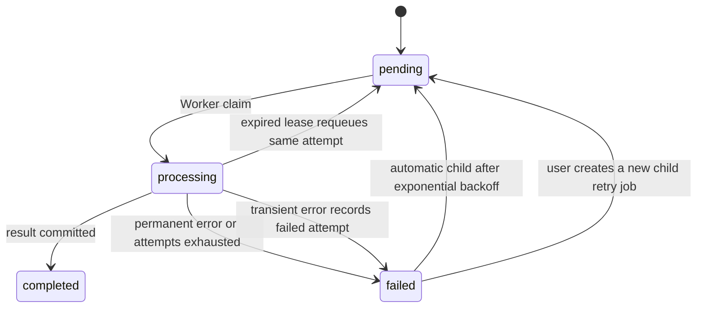

# 需求分析与架构决策

## 1. 已确认的 MVP 边界

系统服务于同一平台中的多个独立组织。用户上传合同、政策或业务材料，系统创建 Review Job，Worker 提取文本并使用确定性 Mock LLM 输出结构化审核。用户可在所属租户间切换、查看团队共享的历史和详情，并重试失败任务。

首版明确不包含注册/邀请 UI、成员管理 UI、真实 LLM、OCR、浏览器内文档预览、计费、邮件、云部署和 CI。用户、租户及 membership 由幂等 seed 固定创建，但登录、JWT、session 和授权检查均使用真实产品路径。

## 2. 信任边界与租户隔离

客户端提供的 `X-Tenant-ID` 只是“选择当前工作区”，不是授权凭证。后端先由 Bearer JWT 确定用户，再查找 `(user_id, tenant_id)` membership；不存在时拒绝请求。业务资源查询同时包含资源 ID 与 `tenant_id`，避免先读取其他租户数据再在应用层判断导致 IDOR 或信息泄露。

| Role | 查看团队文档/结果 | 上传/发起审核 | 重试失败任务 |
| --- | --- | --- | --- |
| owner | 是 | 是 | 是 |
| admin | 是 | 是 | 是 |
| reviewer | 是 | 是 | 是 |
| viewer | 是 | 否 | 否 |

Access token 短期有效；refresh token 使用随机高熵值，数据库只保存 hash，浏览器通过 `HttpOnly`、`SameSite=Lax` cookie 持有。刷新时旧 session 被撤销并轮换。HTTPS 环境必须启用 `Secure` cookie。

## 3. 领域模型

| Entity | 关键字段 | 说明 |
| --- | --- | --- |
| User | email, password_hash, is_active | 全局身份；email 唯一 |
| Tenant | name, slug | 数据隔离根节点 |
| Membership | user_id, tenant_id, role | 用户与租户多对多关系和 RBAC |
| RefreshSession | user_id, token_hash, expires_at, revoked_at | 可撤销、可轮换的登录 session |
| Document | tenant_id, created_by_user_id, storage_path, content_text | 文件元数据、存储 key 和提取文本 |
| ReviewJob | tenant_id, document_id, retry/root IDs, status, result | 一次不可变的审核执行记录 |
| IdempotencyKey | tenant_id, key, content_fingerprint, document/job IDs | 防止上传请求重复创建资源 |

`ReviewJob.result` 保存结构化 JSON，以允许审核 schema 演进；用于列表过滤的 `risk_level` 独立存储。`retry_of_job_id` 指向唯一的直接前驱，`root_job_id` 将同一条审核执行链关联起来。自动和手动重试都创建新记录，不清空或重置原记录。`available_at` 控制延迟任务何时可被 Worker claim。

上传可携带 `Idempotency-Key`。key 的唯一性限定在 tenant 内；相同 key 与相同文件内容返回已创建的 Document/Review Job，相同 key 配合不同内容返回冲突，从而避免网络重放跨租户串扰或重复计费。

## 4. 审核结果 contract

Mock provider 与未来真实 LLM provider 使用同一个公共结果结构：

- `overall_risk_level`: `low | medium | high | critical`
- `risk_score`: `0..100`
- `summary`
- `issues[]`: category、severity、title、description、evidence、location、recommendation、suggested_revision
- `review_scope`
- `model_name`、`prompt_version`、`reviewed_at`

Mock 输出由输入文本确定性生成，使行为测试可复现。PDF 只读取文本层，不执行 OCR；空文本、加密/损坏文件等永久错误应作为明确失败展示。

## 5. 异步任务与可靠性

API 在一个数据库事务内写入 Document 和初始 Review Job，但文件写入无法加入 PostgreSQL 事务，因此数据库提交失败时会补偿删除文件。Worker 使用 `SELECT ... FOR UPDATE SKIP LOCKED` 原子抢占，耗时的文本提取和审核不持有行锁。`locked_at` 和 lease timeout 允许回收 Worker 崩溃遗留的 `processing` 任务。

状态机为：

多个 Worker 可共享 PostgreSQL 队列。任务 claim 只选择 `available_at <= now` 的 pending 记录，并使用 `(status, available_at, created_at)` 索引。临时错误按 `JOB_RETRY_BASE_SECONDS * 2^(attempt-1)` 创建延迟的不可变子任务，达到 `max_attempts` 后停止；永久错误直接结束。唯一的 `retry_of_job_id` 保证并发路径不会为同一次失败创建多个直接子任务。生产规模增长后，可替换为专用队列而不改变 HTTP API 或审核 provider contract。

## 6. 文件与部署

- 支持 `.pdf`、`.docx`、`.txt`、`.md`；默认上限 20 MiB。
- 服务端生成存储文件名，并按 tenant 分目录，避免路径穿越。
- API 提供经过认证和 tenant 校验的下载；不提供公开静态 URL。
- 本地由 API 和 Worker 共享 Docker volume。生产建议改用 S3/OSS object key、恶意文件扫描、静态加密和数据保留策略。
- Alembic 是 schema 唯一版本历史。Compose 由 API 在对外健康前运行 migration 和幂等 seed，Worker 等待 API 健康，避免并发迁移。
- Nginx 同源代理 `/api/`，使 Bearer 请求和 refresh cookie 不依赖跨站 cookie 配置。

## 7. API seam

- `POST /api/v1/auth/login`
- `POST /api/v1/auth/refresh`
- `POST /api/v1/auth/logout`
- `GET /api/v1/auth/me`
- `GET /api/v1/tenants`
- `POST /api/v1/documents`
- `GET /api/v1/documents`
- `GET /api/v1/documents/{document_id}/download`
- `POST /api/v1/documents/{document_id}/reviews`
- `GET /api/v1/review-jobs`
- `GET /api/v1/review-jobs/{job_id}`
- `POST /api/v1/review-jobs/{job_id}/retry`

健康检查为 `GET /healthz`，不包含业务数据。

`POST /documents` 可选请求头：`Idempotency-Key`（最长 255 字符，租户内唯一）。

## 8. 验收策略

测试只从已确认的公共 seams 验证行为：

1. FastAPI HTTP seam：登录、membership/RBAC、跨租户拒绝、上传和重试。
2. Worker seam：通过 API 创建任务，调用公开 Worker 单步入口，再由 API 读取结果。
3. React DOM seam：登录、切换租户、上传、列表/详情和失败重试。
4. Docker HTTP seam：经 Nginx 完成登录、上传、异步处理和结果查询。

实现采用逐个垂直切片的 red → green TDD 循环，不依赖私有 helper 或数据库旁路断言。
